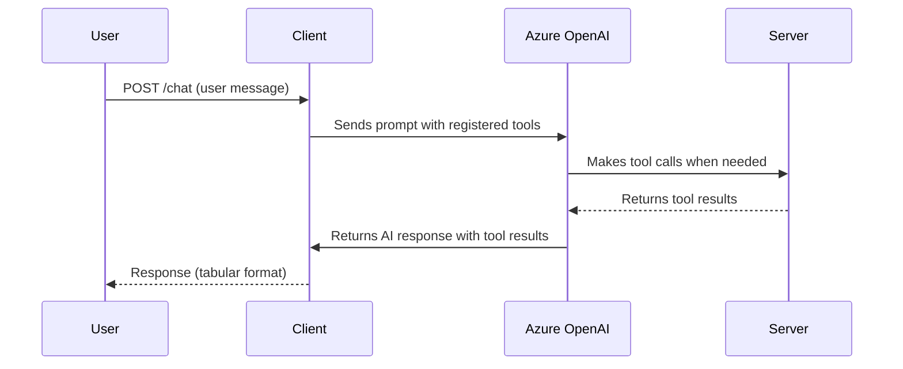
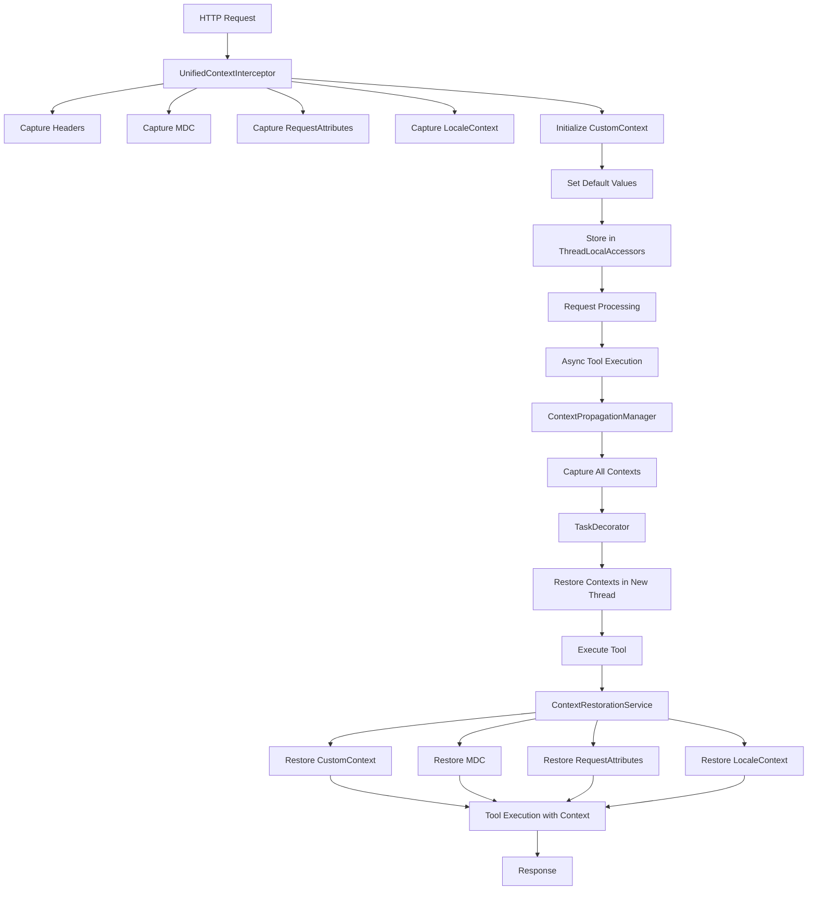

# MCP Client-Server Azure Demo

This project demonstrates a modular, context-propagating, AI-powered client-server architecture using Spring Boot and Spring AI, with integration for Azure OpenAI models. It is organized as a Maven multi-module project with two main components:

- **client**: A Spring Boot application that acts as a chat client, forwarding user prompts to the server and handling AI responses.
- **server**: A Spring Boot application that exposes AI-powered tools (such as user management) and supports context propagation for distributed tracing and async operations.

---

## Table of Contents

- [Overview](#mcp-client-server-azure-demo)
- [Project Structure](#project-structure)
- [Features](#features)
- [Architecture](#architecture)
- [Getting Started](#getting-started)
- [Configuration](#configuration)
- [Build & Run](#build--run)
- [API Overview](#api-overview)
- [Context Propagation](#context-propagation)
- [Example Usage](#example-usage)
- [Extending](#extending)
- [Troubleshooting](#troubleshooting)
- [Contributing](#contributing)
- [License](#license)

---

## Project Structure

```
mcp-client-server-azure/
  ├── client/   # Chat client (Spring Boot, WebFlux)
  ├── server/   # AI tool server (Spring Boot, WebMVC)
  └── pom.xml   # Maven multi-module parent
```

---

## Features

### Client

- Exposes a `/chat` REST endpoint for sending user messages.
- Forwards requests to the server, propagating headers and context.
- Integrates with Azure OpenAI via Spring AI.
- Supports dynamic tool registration and context-aware responses.

### Server

- Exposes AI-powered tools as REST endpoints (e.g., user CRUD, search, time).
- Implements context propagation for headers, MDC, locale, and request attributes.
- Integrates with Spring AI's MCP (Model-Connected Platform) for tool orchestration.
- Provides endpoints for user management (get, add, update, delete, search).

---

## Architecture

This project demonstrates a distributed, context-aware AI system using the following technologies:

- **Spring Boot**: For rapid application development and dependency injection.
- **Spring AI**: To integrate with Azure OpenAI and expose AI-powered tools.
- **WebFlux (Client)**: For reactive, non-blocking HTTP communication.
- **WebMVC (Server)**: For traditional RESTful API endpoints.
- **Context Propagation**: Ensures that headers, logging context (MDC), locale, and request attributes are preserved across async boundaries and between client and server.

### Sequence Diagram



---

## Getting Started

### Prerequisites

- Java 17+
- Maven 3.8+
- Azure OpenAI API key and endpoint

### Configuration

#### Client

Edit `client/src/main/resources/application.properties`:

```properties
spring.ai.azure.openai.api-key=<YOUR-KEY>
spring.ai.azure.openai.endpoint=<YOUR-URL>
spring.ai.azure.openai.chat.options.deployment-name=gpt-4o
```

#### Server

Edit `server/src/main/resources/application.properties` as needed (default port: 8081).

---

### Build & Run

From the project root:

```bash
# Build all modules
mvn clean install

# Start the server
cd server
./mvnw spring-boot:run

# In a new terminal, start the client
cd ../client
./mvnw spring-boot:run
```

---

## API Overview

### Client

- `POST /chat`
  - **Body:** Plain text user message
  - **Headers:** Any custom headers to propagate
  - **Response:** AI-generated response (tabular format if possible)

### Server

- Exposes tool endpoints for user management (see `UserService.java` for details).
- Handles context propagation for distributed and async operations.

---

## Context Propagation

The server implements advanced context propagation using custom `ThreadLocalAccessor` components. This ensures that:

- **Headers**: Custom and authentication headers are preserved.
- **MDC**: Logging context is maintained for distributed tracing.
- **Locale**: User locale is respected for internationalization.
- **Request Attributes**: Request-scoped data is available in async tasks.
- **Custom Context**: Application-specific context parameters are maintained.

This is especially useful for distributed tracing, debugging, and ensuring consistent user experience in async and multi-threaded environments.

### CustomContext ThreadLocal Flow

The project implements a sophisticated custom context propagation system that maintains application-specific context across thread boundaries and async operations.

#### Components

1. **CustomContext**: Core utility class managing ThreadLocal storage
2. **CustomContextParam**: Interface for defining context parameters
3. **ContextParamDefault**: Enum defining default context parameters
4. **CustomContextAccessor**: ThreadLocalAccessor implementation for custom context
5. **ContextPropagationManager**: Orchestrates context capture and restoration
6. **UnifiedContextInterceptor**: Captures context at request entry point
7. **ContextRestorationService**: Restores context in async operations

#### Default Context Parameters

```java
public enum ContextParamDefault implements CustomContextParam {
  REQUEST_ID("REQUEST_ID"),
  CORRELATION_ID("CORRELATION_ID"),
  X_TRAFFIC_TYPE("x-traffic-type"),
  X_TRAFFIC_COLOR("x-traffic-color");
}
```

#### Context Flow Diagram



#### Context Lifecycle

1. **Initialization**: `CustomContext.init()` creates new context with UUID-based request and correlation IDs
2. **Capture**: All context types are captured in `UnifiedContextInterceptor.preHandle()`
3. **Storage**: Contexts are stored in respective `ThreadLocalAccessor` implementations
4. **Propagation**: `ContextPropagationManager` captures and restores contexts across thread boundaries
5. **Restoration**: `ContextRestorationService` restores contexts in async operations
6. **Cleanup**: Contexts are cleared after request completion

#### Usage in Tools

```java
@Tool(name = "getAllUsers", description = "Get all users")
public UsersResponse getAllUsers(int limit, int skip) {
  // Restore all contexts and get headers
  HttpHeaders httpHeaders = contextRestorationService.restoreAllContextsAndGetHeaders();

  // Access custom context
  String trafficType = CustomContext.get(ContextParamDefault.X_TRAFFIC_TYPE);
  String trafficColor = CustomContext.get(ContextParamDefault.X_TRAFFIC_COLOR);

  // Tool logic...
}
```

---

## Example Usage

### Chat Request

```bash
curl --request POST \
  --url http://localhost:8080/chat \
  --header 'Content-Language: en_US' \
  --header 'Content-Type: text/plain' \
  --header 'country: in' \
  --header 'language: en' \
  --header 'x-request-tracking-id: 12345' \
  --data 'I want to have data for user id 6'
```

### Example Response

```
| id | firstName | lastName | age |
|----|-----------|----------|-----|
|  1 | John      | Doe      |  35 |
|  2 | Jane      | Smith    |  40 |
```

---

## Dependencies

- Spring Boot 3.x
- Spring AI (MCP, Azure OpenAI)
- WebFlux (client), WebMVC (server)
- Lombok (server)
- JUnit (tests)

---

## Extending

- Add new tools to the server by annotating methods in service classes with `@Tool`.
- Register new tools in `ToolsConfig.java`.
- Customize context propagation by implementing new `ThreadLocalAccessor`s.
- Add new context parameters by implementing `CustomContextParam` interface.

---

## Troubleshooting

- **Ports**: Ensure the server is running on the port specified in `server/src/main/resources/application.properties` (default: 8081).
- **Azure OpenAI**: Make sure your API key and endpoint are correct and have sufficient quota.
- **CORS**: The server is configured to allow CORS for `/sse` endpoints, but you may need to adjust for your environment.
- **Context Issues**: Check logs for context propagation errors and ensure `CustomContext.init()` is called before accessing context.

---

## Contributing

Contributions are welcome! Please open issues or pull requests for improvements, bug fixes, or new features.

---

## License

This project is for demonstration purposes. 
